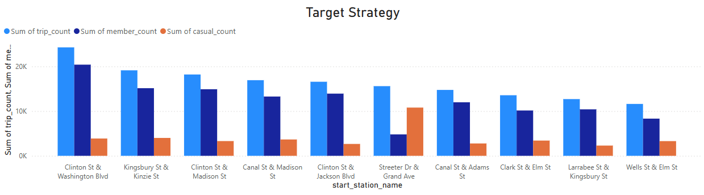

# Case Study - How does a bike-share navigate speedy success?

## Overview
Analysis of casual riders vs  members customer for a bike-share 
company to increase revenue by convert casual riders into members using advertising strategy.

## Business Questions
1. How do annual members and casual riders use Cyclistic bikes differently?
2. Why would casual riders buy Cyclistic annual memberships?
3. How can Cyclistic use digital media to influence casual riders to become members?

## Goal
**Design marketing strategies aimed at converting casual riders into annual members.**

## Analysis Approach

### A. Differences in customer behavior
- Weekly Trend of Bicycle Trip Count by User Type
- The frequently used start stations for member and casual users
- Average trip duration by User Type
- Average trip distance by User Type
- The peak hours of usage within a day vary by user type

    Query: [1_Differences in customer behavior.sql](<Query/1_Differences in customer behavior.sql>)

## Visualization:

### 1. Weekly Trend of Bicycle Trip Count by User Type

*(Visual created using ChatGPT)*

### Key Findings:
#### Casual Riders:
- The highest trip counts occur on weekends, with Saturday as the peak day on average.
- This pattern suggests casual use, likely for recreational or non-routine purposes.

#### Member Riders:
- Average trip counts are highest on weekdays, peaking on Wednesday.
- There is a noticeable decline heading into the weekend, indicating that trips are likely routine or work-related.

### 2. The frequently used start stations for member and casual users

*(Made with Excel)*

### Key Findings:
#### The top 5 start stations vary significantly by customer type:
- Casual riders and member riders have completely different sets of top 5 start stations.

### 3. Average trip duration by User Type

*(Made with Excel)*

### Key Findings:
#### Casual riders take significantly longer trips compared to member riders:
- On average, casual riders' trip durations are approximately twice as long as those of member riders.

### 4. Average trip distance by User Type

*(Made with Excel)*

### Key Findings:
#### Member riders have longer average distance compared to casual riders

### 5. The peak hours of usage within a day vary by user type

*(Made with Excel)*

### Key Findings:
#### Casual Riders:
- Member users tend to be active during typical commuting hours, particularly between 7–9 AM and 4–6 PM.

#### Member Riders:
- Casual users are more active during midday to late afternoon hours (11 AM–5 PM), suggesting a recreational or leisure-based usage pattern.

### B. Why would casual riders buy Cyclistic annual memberships?
- Casual riders who frequently ride during weekday commuting hours (7–9 AM and 4–6 PM) are highly likely to convert to annual members. These users already show routine commuting behavior, similar to members, but are still paying per trip.
- These habitual casual riders would benefit from membership because:
    - Cost savings: Frequent commuting makes a flat-rate membership more economical than paying per ride.

### C. How can Cyclistic use digital media to influence casual riders to become members?
### The Marketing Strategy:

### 1. Targeted Casual Riders
- Cyclistic can leverage digital media to **target casual riders who ride during weekday commuting hours** (7–9 AM and 4–6 PM) from the **busiest stations used by members**.
These riders likely use bikes to commute to and from work, but they are still paying per trip. Since their behavior aligns with that of members, they represent high-potential conversion targets.

    Query: [2_Targeted_customer.sql](<Query/2_Targeted_customer.sql>)
    - **Pilot Project: Focused Digital Campaign on Top 10 Member Stations**

         

         *(Visualized using Power BI)*

        To maximize efficiency and test the strategy at a smaller scale, Cyclistic can launch a pilot digital marketing campaign targeting casual riders who start their trips at the 10 stations with the highest number of member trips during commuting hours (7–9 AM and 4–6 PM on weekdays).
### 2. Using Digital Media Tools
- **Geo-fenced ads** near the selected stations.
- **In-app promotions** triggered when users start a trip at one of the 10 stations.
- **Email campaigns** for casual riders linked to those stations.

## Technical details:
- **Database**: 2024-divvy-tripdata
- **Analysis tools**: SQL (PostgreSQL), Excel
- **Visualization**: Chatgpt, Excel, Power BI

## Conclusion
The analysis reveals distinct behavioral patterns between casual riders and annual members of Cyclistic's bike-share system:

Casual riders primarily use the service on weekends and during midday hours, often for leisure. However, a significant subset of casual riders shows weekday commuting patterns, similar to members.

Members ride mostly during traditional commuting hours (7–9 AM and 4–6 PM), and their trips are shorter in duration but longer in distance—indicative of efficient, routine travel.

### These findings highlight a clear opportunity:

    Cyclistic can increase revenue by converting casual riders who consistently ride during commuting hours into annual members.

To achieve this, a targeted digital marketing campaign—focused on the top 10 stations with the most member trips during peak hours—can be an effective and cost-efficient pilot. By using tools like geo-fenced ads, in-app promotions, and personalized email campaigns, Cyclistic can nudge high-potential casual commuters toward membership, aligning their behavior with a more sustainable pricing model.

## Final Notes
This is my first case study analysis using SQL as the primary analysis tool. The case is inspired by the Google Data Analytics Capstone Project. All analysis, interpretation, and visualizations were completed independently, with guidance and assistance from ChatGPT throughout the process.

This project marks the beginning of my journey in data analytics, and I look forward to growing my skills through more real-world case studies.